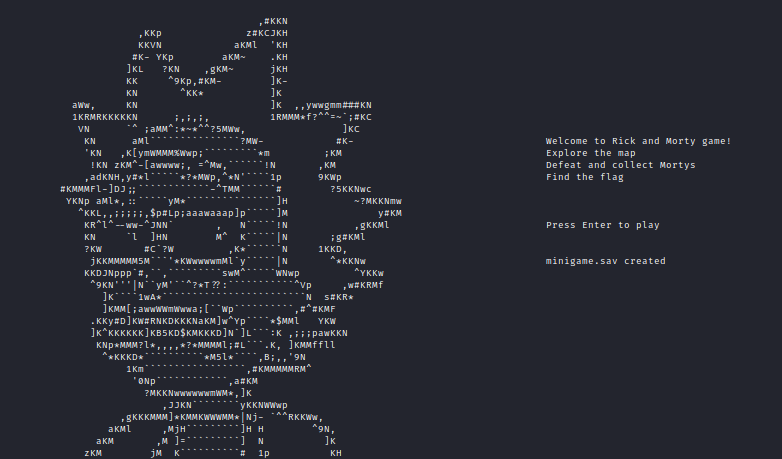
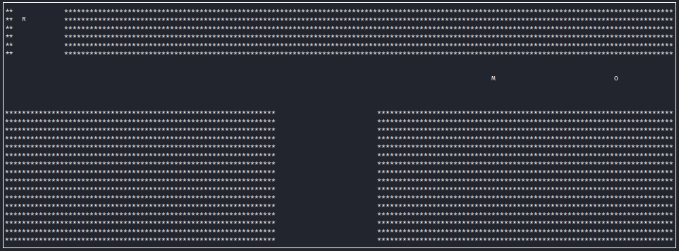
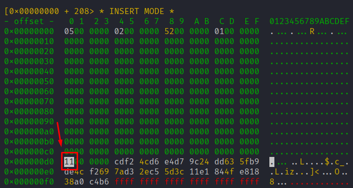
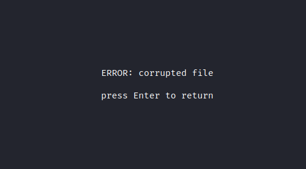
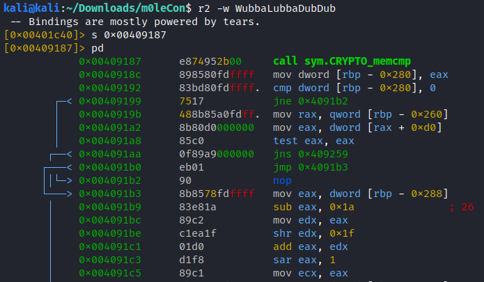
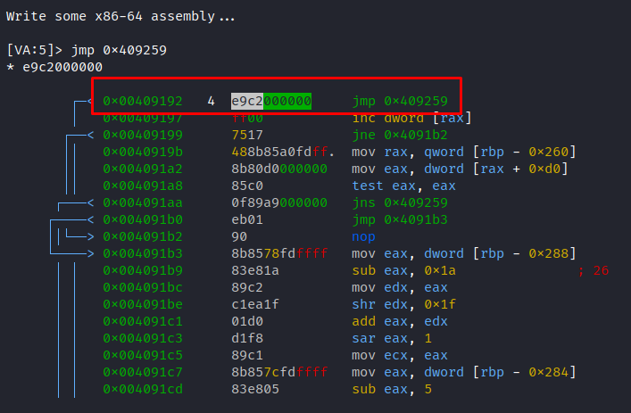
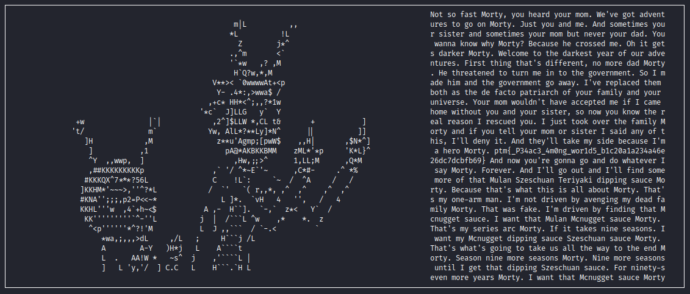

# The Rickshank Rickdemption
>  Welcome to the Rick and Morty universe! The council of Ricks have sent an army of Mortys ready to arrest Rick and cancel the interdimensional cable tv. Defeat them all, reach the last level and try to win. To be fair, you have to have a very high IQ to win.
>
> Author: @AntonioLic, @matpro 


Files provided:
* WubbaLubbaDubDub: ELF64 


```sh
kali@kali:~/Downloads/m0leCon$ file WubbaLubbaDubDub 
WubbaLubbaDubDub: ELF 64-bit LSB executable, x86-64, version 1 (GNU/Linux), statically linked, BuildID[sha1]=9c74a675cc9507ca8f4275237f818b1ffa78cb91, for GNU/Linux 3.2.0, not stripped
```

It's a Rick & Morty themed minigame in which we have to defeat all Mortys. 



The map is composed of 16 section, so 16 Mortys to defeat.




The game allows you to save and load, using `minigame.sav` file: It is always 244 bytes long.

Let's analyze the function `loadgame` with Ghidra:

```c
void loadgame(void)

{
  int iVar1;
  FILE *__stream;
  uint *__ptr;
  size_t len;
  long in_FS_OFFSET;
  int local_290;
  int local_28c;
  SHA256_CTX local_258;
  code *local_1e8 [4];
  code *local_1c8;
  code *local_1c0;
  code *local_1b8;
  code *local_1b0;
  code *local_1a8;
  code *local_1a0;
  code *local_198;
  code *local_190;
  code *local_188;
  code *local_180;
  code *local_178;
  code *local_170;
  code *local_168;
  code *local_160;
  code *local_158;
  code *local_150;
  code *local_148;
  code *local_140;
  code *local_138;
  code *local_130;
  code *local_128;
  code *local_120;
  code *local_118;
  code *local_110;
  code *local_108;
  code *local_100;
  code *local_f8;
  code *local_f0;
  code *local_e8;
  code *local_e0;
  code *local_d8;
  code *local_d0;
  code *local_c8;
  code *local_c0;
  code *local_b8;
  code *local_b0;
  code *local_a8;
  code *local_a0;
  code *local_98;
  code *local_90;
  code *local_88;
  code *local_80;
  code *local_78;
  code *local_70;
  code *local_68;
  code *local_60;
  code *local_58;
  char local_42 [10];
  uchar local_38 [40];
  long local_10;
  
  local_10 = *(long *)(in_FS_OFFSET + 0x28);
  if (stdscr == 0) {
    local_28c = -1;
    local_290 = -1;
  }
  else {
    local_28c = *(short *)(stdscr + 4) + 1;
    local_290 = *(short *)(stdscr + 6) + 1;
  }
  wclear(stdscr);
  __stream = fopen64("minigame.sav","r");
  if (__stream == (FILE *)0x0) {
    iVar1 = (local_290 + -0x1a) / 2;
    mvprintw((local_28c + -5) / 2,iVar1,"ERROR: minigame.sav not found",iVar1);
    iVar1 = (maxX + -0x1a) / 2;
    mvprintw((local_28c + -1) / 2,iVar1,"Press Enter to return",iVar1);
    wrefresh(stdscr);
    do {
      iVar1 = wgetch(stdscr);
    } while (iVar1 != 10);
  }
  else {
    __ptr = (uint *)malloc(0xf4);
    fread(__ptr,0xf4,1,__stream);
    SHA256_Init(&local_258);
    sprintf(local_42,"%d-%d-%d",(ulong)*__ptr,(ulong)__ptr[1],(ulong)__ptr[0x34]);
    len = thunk_FUN_004010f6(local_42);
    SHA256_Update(&local_258,local_42,len);
    SHA256_Final(local_38,&local_258);
    iVar1 = CRYPTO_memcmp(__ptr + 0x35,local_38,0x20);
    if ((iVar1 == 0) && (-1 < (int)__ptr[0x34])) {
      local_1e8[0] = level1;
      local_1e8[1] = func1;
      local_1e8[2] = func18;
      local_1e8[3] = level2;
      local_1c8 = func2;
      local_1c0 = func19;
      local_1b8 = level3;
      local_1b0 = func3;
      local_1a8 = func20;
      local_1a0 = level4;
      local_198 = func4;
      local_190 = func21;
      local_188 = level5;
      local_180 = func5;
      local_178 = func22;
      local_170 = level6;
      local_168 = func6;
      local_160 = func23;
      local_158 = level7;
      local_150 = func7;
      local_148 = func24;
      local_140 = level8;
      local_138 = func8;
      local_130 = func25;
      local_128 = level9;
      local_120 = func9;
      local_118 = func26;
      local_110 = level10;
      local_108 = func10;
      local_100 = func27;
      local_f8 = level11;
      local_f0 = func11;
      local_e8 = func28;
      local_e0 = level12;
      local_d8 = func12;
      local_d0 = func29;
      local_c8 = level13;
      local_c0 = func13;
      local_b8 = func30;
      local_b0 = level14;
      local_a8 = func14;
      local_a0 = func31;
      local_98 = level15;
      local_90 = func15;
      local_88 = func32;
      local_80 = level16;
      local_78 = func16;
      local_70 = func33;
      local_68 = winFunc;
      local_60 = func17;
      local_58 = func34;
      (*local_1e8[(int)((__ptr[0x34] - 1) * 3)])(__ptr);
    }
    else {
      iVar1 = (local_290 + -0x1a) / 2;
      mvprintw((local_28c + -5) / 2,iVar1,"ERROR: corrupted file",iVar1);
      iVar1 = (local_290 + -0x1a) / 2;
      mvprintw((local_28c + -1) / 2,iVar1,"press Enter to return",iVar1);
      do {
        iVar1 = wgetch(stdscr);
      } while (iVar1 != 10);
    }
  }
  if (local_10 != *(long *)(in_FS_OFFSET + 0x28)) {
                    /* WARNING: Subroutine does not return */
    __stack_chk_fail();
  }
  return;
}
```

As we can see,  `minigame.sav` is opened in read mode, and its content put in `__ptr`. 

 `__ptr[0x34]` is used to choose the number of the level to load, from 1 to 16.

But there is a 17th  level:

```c
local_68 = winFunc;
```

So, if `__ptr[0x34]` is equal to `17`, `winFunc` will be called.

Let's modify this value in the save file:



...but, if we try to load the save...



This happens because the functions `loadgame` and `save` uses a SHA256 hash, to check if some value in `minigame.sav` changes: 

```c
	__ptr = (uint *)malloc(0xf4);
    fread(__ptr,0xf4,1,__stream);
    SHA256_Init(&local_258);
    sprintf(local_42,"%d-%d-%d",(ulong)*__ptr,(ulong)__ptr[1],(ulong)__ptr[0x34]);
    len = thunk_FUN_004010f6(local_42);
    SHA256_Update(&local_258,local_42,len);
    SHA256_Final(local_38,&local_258);
    iVar1 = CRYPTO_memcmp(__ptr + 0x35,local_38,0x20);
    if ((iVar1 == 0) && (-1 < (int)__ptr[0x34])) {
          local_1e8[0] = level1;
          local_1e8[1] = func1;
          local_1e8[2] = func18;
          local_1e8[3] = level2;
        .
        .
        .
```


So, we have to patch `WubbaLubbaDubDub` in order to hide the SHA256 check.

Let's do this in `radare2`. 



This is the portion of code in which SHA256 is compared: if the hash is the same, the program will jump to `0x409259`, else it will jump to `0x4091b3`, causing the error. So, we can simply force a jump before the check, in order to avoid `ERROR: corrupted file`.



Now try again to load the save:



The flag is: `ptm{_P34ac3_4m0ng_wor1d5_b1c20a1a234a46e26dc7dcbfb69}`

